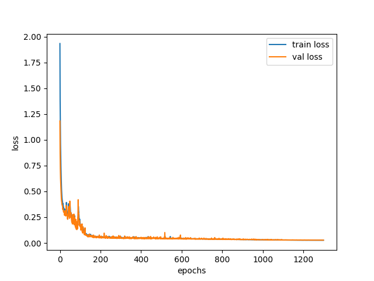
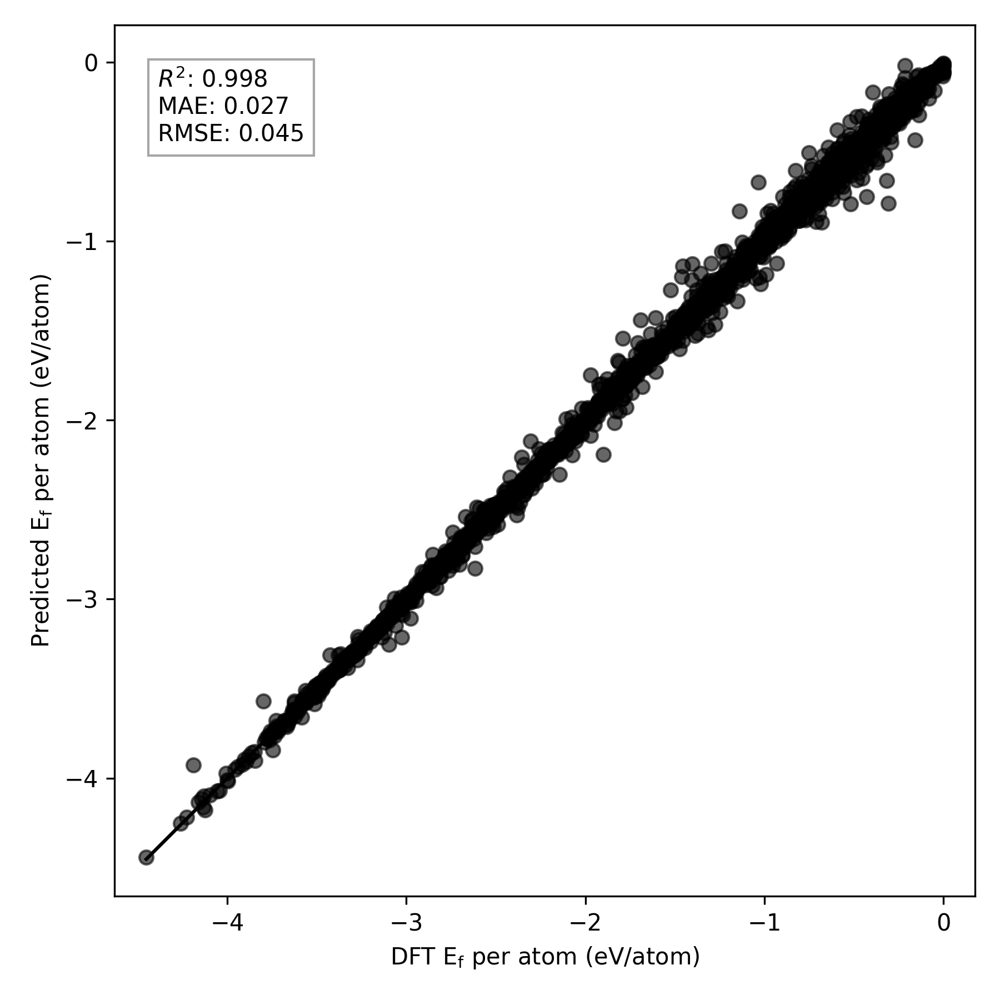

# GMatXAI: GNN-Based Materials Property Prediction

GMatXAI is a deep learning framework for predicting a scalar material property—specifically, **formation energy per atom**—using a custom hybrid Graph Neural Network (GNN) architecture. It supports data from Materials Project, JARVIS, or a combination of both, and uses PyTorch Geometric as its graph learning backend.

---

## Key Features

- **Predicts formation energy per atom** from atomic crystal structures
- Combines **local (CartNet)** and **global (Matformer)** GNN modules
- Supports **Materials Project**, **JARVIS**, and **combined** datasets
- Configurable training using YAML files
- Built-in attention fusion mechanism
- Compatible with CUDA-enabled GPUs (tested with PyTorch 2.6.0 + cu118)

---

## Model Architecture: UniCrystalFormer

The core model is `UniCrystalFormer`, which integrates two GNN backbones:

### -  AtomEncoder
- Embeds atomic numbers and external MEGNet features
- Uses a **gated fusion** mechanism to combine embeddings

### -  Local Encoder: CartNetBlock
- Captures **short-range interactions**
- Applies multiple layers of `CartNet_layer` with radius-based neighbor cutoff

### -  Global Encoder: MatformerBlock
- Captures **long-range dependencies** using MatformerConv (Transformer-based GNN)
- Applies edge-augmented attention layers with MLP + GraphNorm

### -  Fusion
- Local and global embeddings are combined at each layer:
  - By **sum**, or
  - Using an **attention-based fusion mixer**

### -  Readout & Regression
- Uses `Set2Set` pooling for graph-level embedding
- Outputs a scalar prediction via a feed-forward head

---

## Installation

### Recommended Python version: `3.10.10`

### Windows (auto setup)

```bash
setup.bat
```

### Manual setup

```bash
pip install torch==2.6.0 torchvision==0.21.0 torchaudio==2.6.0 --index-url https://download.pytorch.org/whl/cu118
pip install torch_geometric
pip install pyg_lib torch_scatter torch_sparse torch_cluster torch_spline_conv -f https://data.pyg.org/whl/torch-2.6.0+cu118.html
pip install -r requirements.txt
```

## Dataset Preparation

This project provides a dataset generation script that collects atomic structure data from the **Materials Project (MP)** and **JARVIS (JV)** databases. These are automatically preprocessed and saved in `train.pkl`, `val.pkl`, and `test.pkl` formats.

### Run Dataset Generator

Use the following command to create datasets:

```bash
make_dataset.bat
```
This will internally call make_dataset.py, which supports the following datasets:

- "mp": Materials Project only
- "jv": JARVIS only
- "mpjv": Concatenation of MP and JV (default)
- "jvmp": Same as "mpjv" but loading JV first (equivalent in content)

You may specify the dataset type and number of entries like this:

```bash
python make_dataset.py --dataset mpjv --num_entries 1000 --target formation_energy_per_atom band_gap
```

### What Happens Internally
1. Materials Project Data (via MAPI):

   -  Uses MPRester to fetch structures with specific scalar properties.

    - Fields like "formation_energy_per_atom" and "band_gap" are retrieved.

    - Converts MP structures to JARVIS-style dictionary format using mp_to_jarvis().

2. JARVIS Data (via Figshare):

    - Downloads from JARVIS DFT dataset.

    - Maps fields like formation_energy_peratom → formation_energy_per_atom.

3. Merge and Split:

    - The combined dataset is randomly shuffled.

    - Split into:

        - 80% training

        - 10% validation

        - 10% test

    - Saved as:

        - train.pkl

        - val.pkl

        - test.pkl

These files are saved in the `data/<dataset>/` directory.

### Target Properties
By default, the script extracts the following scalar properties:

- formation_energy_per_atom (default)

- band_gap

- energy_above_hull

You can customize the list of target properties using the `--target` flag.

### Tip
Make sure you have set your Materials Project API key (MAPI) in a .env file like this:

```ini
MAPI=your_api_key_here
```
This is required to access MP data.

## Model Training
Run training using a config file:

```bash
python main.py --config configs/test.yaml
```
You may adjust hyperparameters and dataset paths in the YAML file.

## Project Structure
```bash
GMatXAI/
├── main.py                  # Training entry point
├── make_dataset.bat         # Generate datasets
├── setup.bat                # Auto environment setup
├── requirements.txt         # Dependency list
├── configs/                 # Training configuration files
├── src/
│   ├── data/                # Dataset and preprocessing scripts
│   ├── model/               # GNN model architecture
│   ├── train/               # Training pipeline
│   ├── utils/               # Utilities (logging, parsing, etc.)
├── outputs/                 # Saved models, logs, predictions
└── README.md
```

## Dependencies
- Python ≥ 3.10

- PyTorch 2.6.0

- PyTorch Geometric

- NumPy, pandas, scikit-learn

- tqdm, matplotlib, pyyaml

## Output
All training artifacts (logs, checkpoints, results) are saved under:
``` bash
outputs/
```

---

## Model Architecture: UniCrystalFormer (Design Rationale)

The `UniCrystalFormer` model is a **hybrid multi-scale Graph Neural Network (GNN)** tailored to model the quantum-informed formation energy of crystalline materials. Its design draws on physical principles of solid-state chemistry and graph representation learning.

---

### 1. **Atomic Embedding (AtomEncoder)**

Each atom is represented using both:

* Its **atomic number** $Z \in \mathbb{N}$
* A vector of **16 MEGNet features** $\mathbf{f}_{\text{megnet}} \in \mathbb{R}^{16}$

The encoder fuses these through a **gated mechanism**:

$$
\begin{align*}
\mathbf{e}_{\text{atom}} &= \text{Embedding}(Z) \in \mathbb{R}^d \\
\mathbf{e}_{\text{megnet}} &= \text{Linear}(\mathbf{f}_{\text{megnet}}) \in \mathbb{R}^d \\
\mathbf{g} &= \sigma\left( \text{Linear}([\mathbf{e}_{\text{atom}}, \mathbf{e}_{\text{megnet}}]) \right) \\
\mathbf{h}_0 &= \mathbf{g} \odot \mathbf{e}_{\text{atom}} + (1 - \mathbf{g}) \odot \mathbf{e}_{\text{megnet}}
\end{align*}
$$

This **gated fusion** allows the model to adaptively balance data-driven atomic representations and physically-informed descriptors.

---

### 2. **Edge Encoding (RBF Expansion)**

Interatomic distances $d_{ij} = \|\mathbf{r}_i - \mathbf{r}_j\|$ are encoded via a **Radial Basis Function (RBF)** expansion to improve expressiveness:

$$
\text{RBF}(d_{ij})_k = \exp\left( -\gamma (d_{ij} - \mu_k)^2 \right), \quad \mu_k = \text{linspace}(r_{\text{min}}, r_{\text{max}})
$$

This allows smooth and differentiable representation of pairwise distances for subsequent message passing.

---

### 3. **Local Encoder: CartNetBlock (Short-range Modeling)**

To model **short-range interactions**, such as covalent bonds or local coordination environments, `CartNet_layer` applies a distance-based convolution restricted to a **cutoff radius** $r_c$:

* Nodes within radius $r_{ij} < r_c$ form the local graph $\mathcal{G}_\text{local}$
* Message function incorporates geometric info (e.g., direction vectors)
* Layer applies:

$$
\mathbf{h}_i^{(l+1)} = \text{Norm}\left( \mathbf{h}_i^{(l)} + \sum_{j \in \mathcal{N}_r(i)} M_\theta(\mathbf{h}_i^{(l)}, \mathbf{h}_j^{(l)}, \mathbf{r}_{ij}) \right)
$$

Where:

* $\mathcal{N}_r(i)$: neighbors within cutoff $r_c$
* $M_\theta$: learnable message function
* Geometric inductive bias is embedded directly via $\mathbf{r}_{ij}$

This captures local physics like bond angles, steric effects, and coordination geometry.

---

### 4. **Global Encoder: MatformerBlock (Long-range Modeling)**

Long-range interactions (e.g., electrostatics, delocalized electrons) are modeled using **MatformerConv**, a **Transformer-inspired GNN layer** with attention over graph structure:

$$
\mathbf{h}_i^{(l+1)} = \mathbf{h}_i^{(l)} + \sum_{j \in \mathcal{N}(i)} \alpha_{ij} W_v \mathbf{h}_j
$$

Where:

* Attention weights:

$$
\alpha_{ij} = \frac{
    \exp\left( \frac{ (W_q \mathbf{h}_i)^T (W_k \mathbf{h}_j + W_e \mathbf{e}_{ij}) }{ \sqrt{d} } \right)
}{
    \sum_{k \in \mathcal{N}(i)} \exp\left( \frac{ (W_q \mathbf{h}_i)^T (W_k \mathbf{h}_k + W_e \mathbf{e}_{ik}) }{ \sqrt{d} } \right)
}
$$

This attention mechanism allows the model to **weight distant nodes** dynamically based on both node and edge features.

---

### 5. **Fusion Layer: Multi-Scale Integration**

To combine local $\mathbf{h}_{\text{local}}$ and global $\mathbf{h}_{\text{global}}$ embeddings:

* **Option 1 (Simple Sum)**:

  $$
  \mathbf{h}_{\text{fused}} = \mathbf{h}_{\text{local}} + \mathbf{h}_{\text{global}}
  $$

* **Option 2 (Attention Fusion)**:

  $$
  \mathbf{h}_{\text{fused}} = \text{softmax}([s_A, s_B]) \cdot [\mathbf{h}_{\text{local}}, \mathbf{h}_{\text{global}}]
  $$

Where $s_A, s_B = \text{score}_\theta(\cdot)$ are scalar confidence scores. This enables **adaptive layerwise control** over fusion weights.

---

### 6. **Graph Readout & Regression Head**

Global pooling uses **Set2Set**, a learnable attention-based graph pooling operator:

$$
\mathbf{g} = \text{Set2Set}(\{ \mathbf{h}_i \}_{i=1}^N)
$$

Final prediction:

$$
\hat{y} = \text{MLP}(\mathbf{g}) \in \mathbb{R}
$$

---

### Summary

| Design Element         | Physical Motivation                                  | Learning Capability                           |
| ---------------------- | ---------------------------------------------------- | --------------------------------------------- |
| Local GNN (CartNet)    | Captures short-range chemical bonding                | Radius-limited message passing                |
| Global GNN (Matformer) | Captures long-range effects like charge distribution | Attention-based dynamic neighborhood          |
| Fusion Mechanism       | Multi-scale modeling (like DFT+DFTB)                 | Learnable combination of local/global         |
| MEGNet Features        | Known physical descriptors                           | Accelerates convergence                       |
| RBF Edge Expansion     | Distance-sensitive modeling                          | Smooth non-linear transformation of distances |

---

## Experiment Comparison: Attention Fusion & Target Normalization

### Experiment Settings Recap (Top3)

| Experiment | Attention Fusion | Y Normalization | MAE (eV)   | R²         | Best Val Loss | Final Train Loss |
| ---------- | ---------------- | --------------- | ---------- | ---------- | ------------- | ---------------- |
| Test 1     | X                | X               | **0.0268** | **0.9980** | 0.0275        | 0.0266           |
| Test 2     | O                | X               | 0.0283     | 0.9978     | 0.0278        | **0.0255**       |
| Test 3     | X                | O               | 0.0275     | 0.9980     | 0.0277        | 0.0279           |

---

### What is Attention Fusion?

`AttentionFusionMixer` dynamically learns the importance of local (CartNet) vs global (Matformer) representations at each node. Rather than simply summing them, it computes attention weights:

$$
\mathbf{h}_{\text{fused}} = \alpha \cdot \mathbf{h}_{\text{local}} + (1 - \alpha) \cdot \mathbf{h}_{\text{global}}
$$

#### Why it can help:

* Adapts fusion strategy per node, useful for **heterogeneous crystals**.
* Improves expressive capacity where some nodes benefit more from global structure (e.g., delocalized systems).

#### Why it might hurt:

* If the dataset is homogeneous, learned fusion may introduce **unnecessary complexity**, leading to **overfitting** or **training instability**.
* Adds additional learnable parameters → needs more data to generalize.

**In this case**, Test 1 (no attention fusion) slightly outperformed Test 2, indicating that **simple summation worked better** for this dataset.

---

### What is Target Normalization? (Test 3)

In Test 4, the target property (`formation_energy_per_atom`) was normalized—typically via min-max scaling or standardization:

$$
y_{\text{norm}} = \frac{y - \mu}{\sigma}
$$

This is common in regression tasks to:

* Improve numerical stability during training
* Reduce the risk of gradient explosion/vanishing
* Balance the scale of the loss function

#### Why it can help:

* Especially useful when target distribution is skewed or wide-ranging.
* Helps **stabilize training** for low-scale targets (e.g., 0–1 eV).

#### In our result:

* Test 3 achieved **comparable performance** to Test 1 in both MAE and R².

---

### Summary

| Design Choice          | Effect (in this study)                           |
| ---------------------- | ------------------------------------------------ |
| Attention Fusion     | Slight **overfitting**, no clear gain            |
| Target Normalization | **Slight regularization**, stable generalization |


---

## Best Model Configuration: **Test 1**

### Model Architecture

| **Category**       | **Parameter**     | **Value** |
| ------------------ | ----------------- | --------- |
| **Embedding**      | `hidden_dim`      | 128       |
| **Local Encoder**  | `num_cart_layers` | 3         |
| **Global Encoder** | `num_mat_layers`  | 3         |
|                    | `num_heads`       | 4         |
| **Edge Encoding**  | `edge_features`   | 128       |
|                    | `radius`          | 8.0 Å     |
| **Readout**        | `fc_features`     | 128       |
| **Output**         | `output_features` | 1         |
| **Fusion**         | `use_att_fusion`  | X `False` |
| **Regularization** | `dropout`         | 0.1       |

---

### Training Configuration

| **Category**  | **Parameter**        | **Value**     |
| ------------- | -------------------- | ------------- |
| **Hardware**  | `device`             | `cuda` (GPU)  |
| **Training**  | `epochs`             | 1300          |
|               | `loss_fn`            | L1 Loss (MAE) |
| **Optimizer** | `name`               | AdamW         |
|               | `lr` (learning rate) | 0.001         |
|               | `weight_decay`       | 0.01          |
| **Scheduler** | `name`               | OneCycleLR    |
|               | `max_lr`             | 0.005         |
|               | `pct_start`          | 0.1           |

---

### Performance Visualizations

#### Training & Validation Loss Curve




---

#### Parity Plot (True vs Predicted)


